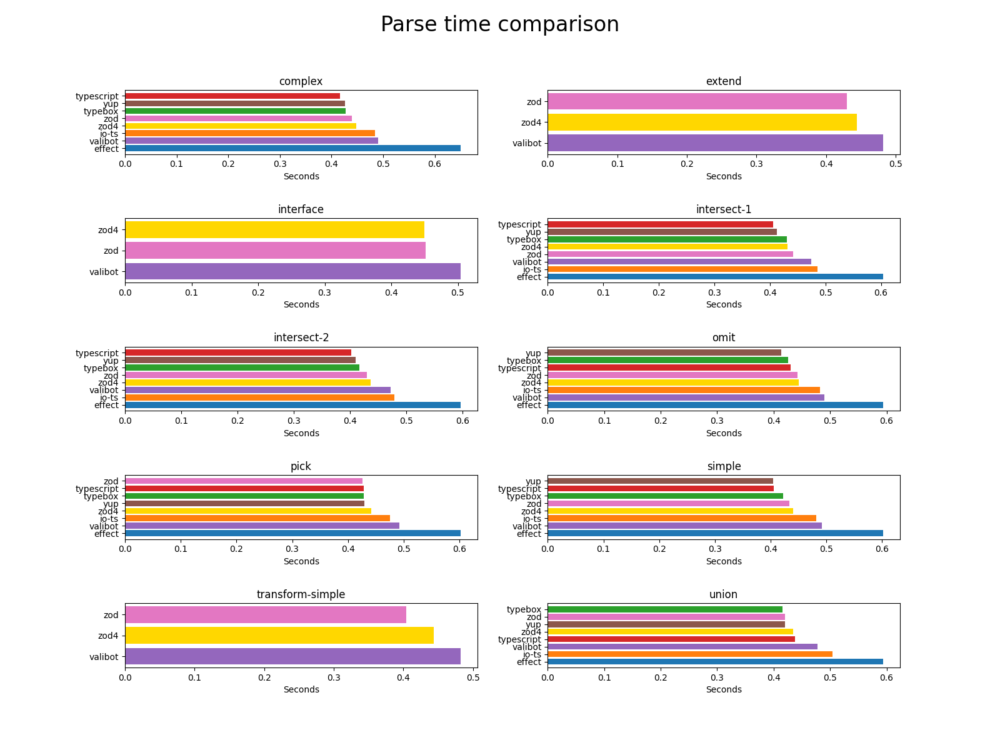
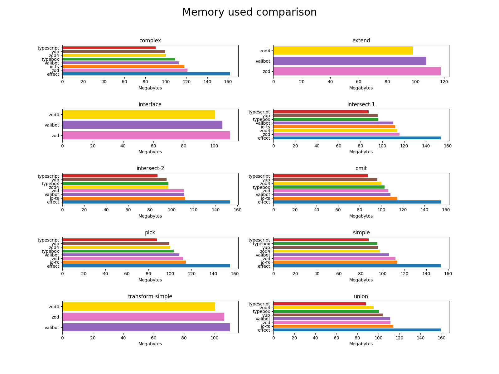

# Schema Validation Benchmark <!-- omit in toc -->

At [Softnetics Team](https://www.softnetics.tech/), we specialize in building software using TypeScript. Data validation is a crucial part of our work, as we need to verify and convert user input into the correct format. Initially, we chose [Zod](https://zod.dev/) as our schema validation library. However, as our applications grew larger, we noticed high CPU and memory usage during TypeScript compilation, particularly in development. Our research revealed that these performance issues stemmed from the validation library itself. This led us to conduct a benchmark study comparing CPU and memory usage across different schema validation libraries.

# Table of Contents <!-- omit in toc -->

- [Environment](#environment)
  - [System Information](#system-information)
  - [Library Version](#library-version)
- [Test Cases Explanation](#test-cases-explanation)
  - [Test Case 1: Simple](#test-case-1-simple)
  - [Test Case 2: Extend](#test-case-2-extend)
  - [Test Case 3: Union](#test-case-3-union)
  - [Test Case 4: Complex](#test-case-4-complex)
  - [Additional Test Cases 1: Transform](#additional-test-cases-1-transform)
- [Running the benchmark](#running-the-benchmark)
- [Benchmark Result](#benchmark-result)
  - [Check Time](#check-time)
  - [Parse Time](#parse-time)
  - [Memory Used](#memory-used)
  - [Number of Types](#number-of-types)
- [Summary](#summary)
- [Add more testcases or candidates](#add-more-testcases-or-candidates)
  - [Add more testcases](#add-more-testcases)
  - [Add more candidates](#add-more-candidates)
- [Run the benchmark yourself](#run-the-benchmark-yourself)

# Environment

## System Information

| Component | Version                      | Note          |
| --------- | ---------------------------- | ------------- |
| OS        | ubuntu-22.04 vCPU 4 RAM 16GB | GitHub Action |
| Node.js   | 20.16.0                      |               |
| Bun       | 1.1.10                       |               |
| Pnpm      | 9.14.2                       |               |
| Python    | 3.13.0                       |               |

## Library Version

| Library                                               | Version                    |
| ----------------------------------------------------- | -------------------------- |
| [Zod](https://zod.dev/)                               | 3.24.1                     |
| [Zod4](https://zod.dev/)                              | 4.0.0-beta.20250414T061543 |
| [typebox](https://github.com/sinclairzx81/typebox)    | 0.34.14                    |
| [arktype](https://arktype.io/)                        | 2.0.3                      |
| [valibot](https://valibot.dev/)                       | 1.0.0-beta.14              |
| [yup](https://github.com/jquense/yup)                 | 1.6.1                      |
| [@effect/schema](https://github.com/Effect-TS/effect) | 0.75.5                     |

# Test Cases Explanation

For this benchmark, we generated test cases using [typebox-codegen](https://github.com/sinclairzx81/typebox-codegen). Each test case was carefully crafted with specific objectives and varying levels of complexity. To ensure a fair and meaningful comparison, we verified that all libraries produced identical TypeScript type outputs. You can find all the test cases in the [samples](./samples) directory.

## Test Case 1: Simple

The "simple" test case is a basic schema with a single object containing a string and array field.

## Test Case 2: Extend

The "extend" test case is a schema use "extend" feature of each library.

## Test Case 3: Union

The "union" test case is a schema use "union" feature of each library. Especially, discriminate union.

## Test Case 4: Complex

The "complex" test case is a schema use common Typescript type helper e.g. `Extract`, `Omit`, `Union`, `Extend`, etc. combined all of the above together.

## Additional Test Cases 1: Transform

This test cases will use `transform` feature of each library and will infer Input and Output type. As of now, only [Zod](https://zod.dev/) and [Valibot](https://valibot.dev/) support this feature.

For further information about the data preparation can be found in the [Samples README.md](./samples/README.md).

# Running the benchmark

The benchmark is run by [GitHub Action](https://github.com/features/actions) with the following step.

1. Generate the test cases for each library using [typebox-codegen](https://github.com/sinclairzx81/typebox-codegen).
2. Run the benchmark using `tsc --extendedDiagnostics` each generated files to get the semantic diagnostics e.g. memory usage, compile time, etc.

   - After this step we will get the result in the `./samples/__benchmarks__` directory. which contains the output of the `tsc --extendedDiagnostics` command. For more information about the output, you can refer to the [TypeScript documentation](https://github.com/microsoft/TypeScript/wiki/Performance).

3. Read the result and generate the report using [Pandas](https://pandas.pydata.org/) and [Matplotlib](https://matplotlib.org/).

# Benchmark Result

The **TypeScript** candidate performs the best across all metrics, as it leverages native TypeScript types. However, it is not a schema validation library. It can serve as a reference point for comparing the performance of other libraries.

## Check Time

Check time refers to the duration taken by the TypeScript compiler to check and infer the types of the program. A lower check time indicates better performance and an enhanced developer experience.

[Zod](https://zod.dev/) exhibits the highest check time, which is approximately twice as long as the second-highest check time, [Effect](https://effect.website/) , in all test cases. Both [Valibot](https://valibot.dev/) and [Effect](https://effect.website/) show similar check times, but they are about twice as long as the other libraries.

## Parse Time

Parse time is the time required by the TypeScript compiler to generate Abstract Syntax Trees (ASTs) for the program. A lower parse time generally indicates simpler code, which improves editor performance and enhances the developer experience.

As shown, [Effect](https://effect.website/) consistently has the highest parse time across all test cases, suggesting that it has the most complex type system. The other libraries show no significant difference in parse time compared to TypeScript, which serves as the baseline.

## Memory Used

Memory usage refers to the amount of memory consumed by the TypeScript compiler when executing the `tsc` command. This metric is crucial for developer experience.

As depicted, most libraries exhibit similar memory usage across all test cases, with the exception of [Effect](https://effect.website/), which consistently uses the most memory. The other libraries do not show a significant difference in memory usage when compared to TypeScript, the baseline.

## Number of Types

The number of types indicates how many types are generated by the schema file. A lower number of types leads to better performance, as the TypeScript compiler needs to check fewer types and generate smaller ASTs.

Interestingly, [Zod](https://zod.dev/) stands out as an outlier in this metric, while the other libraries exhibit little variation in the number of types, compared to TypeScript.

# Summary

The best schema validation library is [Yup](https://github.com/jquense/yup) and [io-ts](https://github.com/gcanti/io-ts) due to its low memory usage and quick compile time. However, it's important to note that they lacks certain advanced features, such as `transform`, `refine`, and `discriminatedUnion`, which are commonly used in real-world applications. Therefore, the best schema validation library for the [Softnetics Team](https://www.softnetics.tech/) would be [Valibot](https://valibot.dev/), as it is the fastest feature-rich library available and Typescript-first schema validation like [Zod](https://zod.dev/).

Unfortunately, the [Valibot](https://valibot.dev/) community is not as large as that of [Zod](https://zod.dev/). If having a strong community is a priority, [Zod](https://zod.dev/) remains the best option for now.

Let me know if you need further refinements!

The best schema validation libraries in terms of performance are [Yup](https://github.com/jquense/yup) and [io-ts](https://github.com/gcanti/io-ts), owing to their low memory usage and quick compilation times. However, they lack certain advanced features, such as `transform`, `refine`, and `discriminatedUnion`, which are often required in real-world applications. Therefore, for the [Softnetics Team](https://www.softnetics.tech/), the ideal choice would be [Valibot](https://valibot.dev/), as it combines speed, rich feature support, and a TypeScript-first approach, similar to [Zod](https://zod.dev/).

It’s worth noting that the [Valibot](https://valibot.dev/) community is smaller than that of [Zod](https://zod.dev/). If a strong community is a priority, [Zod](https://zod.dev/) remains the best option for now.

Let me know if you need further refinements!

# Add more testcases or candidates

## Add more testcases

To add more testcases ou can follow the steps below.

1. Add a new test case in the [samples](./samples) directory. [common](./samples/common) directory contains common test cases that can be used in multiple libraries. [custom](./samples/custom) directory contains test cases that are specific to a library.
2. Open Pull Request to this repository.

## Add more candidates

To add more candidates you can follow the steps below.

1. Go to [src/constants/library.ts](./src/constants/library.ts) and add a new candidate.
2. Open Pull Request to this repository.

# Run the benchmark yourself

To run the benchmark yourself, you can follow the step which described in [GitHub Action](./.github/workflows/benchmark.yaml) file.
